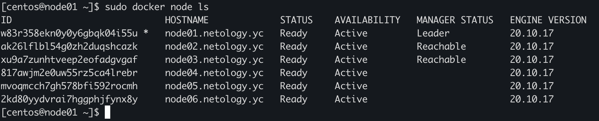
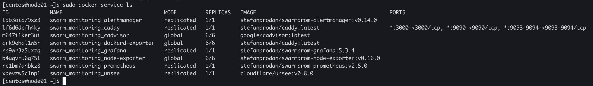
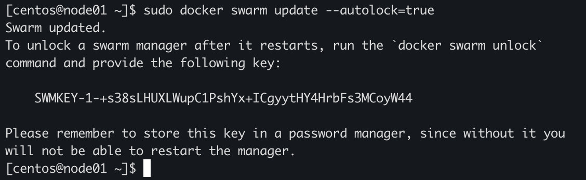

# Домашнее задание к занятию "5.5. Оркестрация кластером Docker контейнеров на примере Docker Swarm"

## Задача 1

Дайте письменые ответы на следующие вопросы:

- В чём отличие режимов работы сервисов в Docker Swarm кластере: replication и global?
```
Replication автомаически раскидывает реплики, количество которых нужно указывать. Global запускает задачу на всех узлах, в том числе когда добавляется узел. Пример использования: мониторинг, антивирусные сканеры или другие типы, которые требуется запускать на каждом узле.
```

- Какой алгоритм выбора лидера используется в Docker Swarm кластере?
```
Raft - если обычный узел долго не получает сообщение от лидера, он рассылает запрос на голосование и переходит в состояние кандидата. Если в кластере несколько кандидатов и голоса разделились, то запустится повторное голосование. Если за это время лидер вернется, то кандидат снимет свою кандидатуру. Если нового лидера выберут и потом вернется старый, то старый превратится в обычный хост.
```

- Что такое Overlay Network?
```
Overlay-network используются в контексте кластеров (Docker Swarm), где виртуальная сеть, которую используют контейнеры, связывает несколько физических хостов, на которых запущен Docker. Позволяет подключенным контейнерам безопасно обмениваться данными.
```

## Задача 2

Создать ваш первый Docker Swarm кластер в Яндекс.Облаке

Для получения зачета, вам необходимо предоставить скриншот из терминала (консоли), с выводом команды:
```
docker node ls
```

<p align="center">
  
</p>


## Задача 3

Создать ваш первый, готовый к боевой эксплуатации кластер мониторинга, состоящий из стека микросервисов.

Для получения зачета, вам необходимо предоставить скриншот из терминала (консоли), с выводом команды:
```
docker service ls
```

<p align="center">
  
</p>

## Задача 4 (*)

Выполнить на лидере Docker Swarm кластера команду (указанную ниже) и дать письменное описание её функционала, что она делает и зачем она нужна:
```
# см.документацию: https://docs.docker.com/engine/swarm/swarm_manager_locking/
docker swarm update --autolock=true
```

<p align="center">
  
</p>

```
Команда позволяет зашифровать ключ шифрующий логи Raft и TLS ключ используемый для шифрования коммуникаций между нодами другим ключом, для дополнительной безопасности.
```