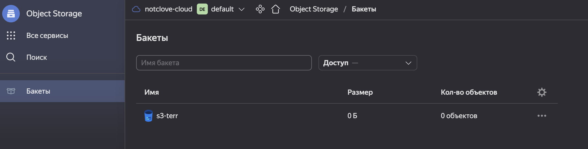
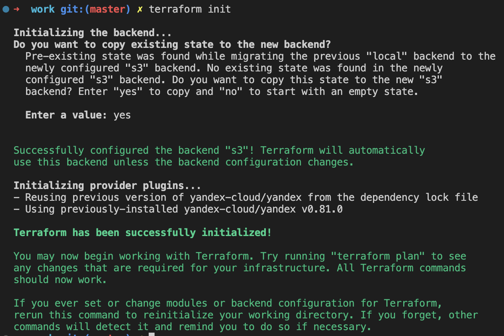
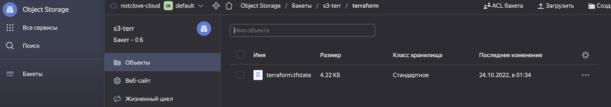
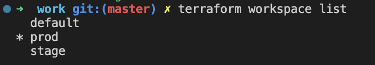
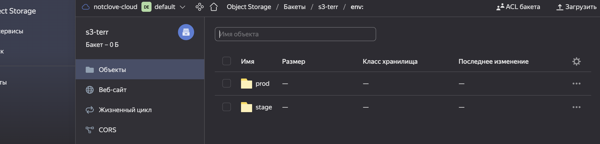
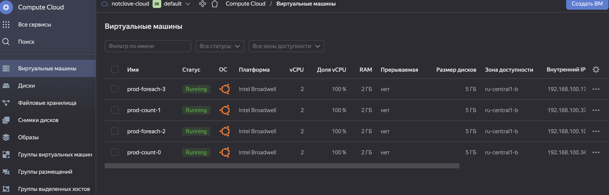

# Домашнее задание к занятию "7.3. Основы и принцип работы Терраформ"

## Задача 1. Создадим бэкэнд в S3 (необязательно, но крайне желательно).



## Задача 2. Инициализируем проект и создаем воркспейсы. 

1. Выполните `terraform init`:





1. Создайте два воркспейса `stage` и `prod`.




В виде результата работы пришлите:
* Вывод команды `terraform plan` для воркспейса `prod`.  

    ```
    Terraform used the selected providers to generate the following execution plan. Resource actions are indicated with the following
    symbols:
  + create

    Terraform will perform the following actions:

    # yandex_compute_instance.vm-1-count[0] will be created
    + resource "yandex_compute_instance" "vm-1-count" {
        + created_at                = (known after apply)
        + folder_id                 = (known after apply)
        + fqdn                      = (known after apply)
        + hostname                  = (known after apply)
        + id                        = (known after apply)
        + metadata                  = {
            + "ssh-keys" = <<-EOT
                    ubuntu:**
                EOT
            }
        + name                      = "prod-count-0"
        + network_acceleration_type = "standard"
        + platform_id               = "standard-v1"
        + service_account_id        = (known after apply)
        + status                    = (known after apply)
        + zone                      = (known after apply)

        + boot_disk {
            + auto_delete = true
            + device_name = (known after apply)
            + disk_id     = (known after apply)
            + mode        = (known after apply)

            + initialize_params {
                + block_size  = (known after apply)
                + description = (known after apply)
                + image_id    = "fd89ovh4ticpo40dkbvd"
                + name        = (known after apply)
                + size        = (known after apply)
                + snapshot_id = (known after apply)
                + type        = "network-hdd"
                }
            }

        + network_interface {
            + index              = (known after apply)
            + ip_address         = (known after apply)
            + ipv4               = true
            + ipv6               = (known after apply)
            + ipv6_address       = (known after apply)
            + mac_address        = (known after apply)
            + nat                = true
            + nat_ip_address     = (known after apply)
            + nat_ip_version     = (known after apply)
            + security_group_ids = (known after apply)
            + subnet_id          = (known after apply)
            }

        + placement_policy {
            + host_affinity_rules = (known after apply)
            + placement_group_id  = (known after apply)
            }

        + resources {
            + core_fraction = 100
            + cores         = 2
            + memory        = 2
            }

        + scheduling_policy {
            + preemptible = (known after apply)
            }
        }

    # yandex_compute_instance.vm-1-count[1] will be created
    + resource "yandex_compute_instance" "vm-1-count" {
        + created_at                = (known after apply)
        + folder_id                 = (known after apply)
        + fqdn                      = (known after apply)
        + hostname                  = (known after apply)
        + id                        = (known after apply)
        + metadata                  = {
            + "ssh-keys" = <<-EOT
                    ubuntu:**
                EOT
            }
        + name                      = "prod-count-1"
        + network_acceleration_type = "standard"
        + platform_id               = "standard-v1"
        + service_account_id        = (known after apply)
        + status                    = (known after apply)
        + zone                      = (known after apply)

        + boot_disk {
            + auto_delete = true
            + device_name = (known after apply)
            + disk_id     = (known after apply)
            + mode        = (known after apply)

            + initialize_params {
                + block_size  = (known after apply)
                + description = (known after apply)
                + image_id    = "fd89ovh4ticpo40dkbvd"
                + name        = (known after apply)
                + size        = (known after apply)
                + snapshot_id = (known after apply)
                + type        = "network-hdd"
                }
            }

        + network_interface {
            + index              = (known after apply)
            + ip_address         = (known after apply)
            + ipv4               = true
            + ipv6               = (known after apply)
            + ipv6_address       = (known after apply)
            + mac_address        = (known after apply)
            + nat                = true
            + nat_ip_address     = (known after apply)
            + nat_ip_version     = (known after apply)
            + security_group_ids = (known after apply)
            + subnet_id          = (known after apply)
            }

        + placement_policy {
            + host_affinity_rules = (known after apply)
            + placement_group_id  = (known after apply)
            }

        + resources {
            + core_fraction = 100
            + cores         = 2
            + memory        = 2
            }

        + scheduling_policy {
            + preemptible = (known after apply)
            }
        }

    # yandex_compute_instance.vm-1-fe["2"] will be created
    + resource "yandex_compute_instance" "vm-1-fe" {
        + created_at                = (known after apply)
        + folder_id                 = (known after apply)
        + fqdn                      = (known after apply)
        + hostname                  = (known after apply)
        + id                        = (known after apply)
        + metadata                  = {
            + "ssh-keys" = <<-EOT
                    ubuntu:**
                EOT
            }
        + name                      = "prod-foreach-2"
        + network_acceleration_type = "standard"
        + platform_id               = "standard-v1"
        + service_account_id        = (known after apply)
        + status                    = (known after apply)
        + zone                      = (known after apply)

        + boot_disk {
            + auto_delete = true
            + device_name = (known after apply)
            + disk_id     = (known after apply)
            + mode        = (known after apply)

            + initialize_params {
                + block_size  = (known after apply)
                + description = (known after apply)
                + image_id    = "fd89ovh4ticpo40dkbvd"
                + name        = (known after apply)
                + size        = (known after apply)
                + snapshot_id = (known after apply)
                + type        = "network-hdd"
                }
            }

        + network_interface {
            + index              = (known after apply)
            + ip_address         = (known after apply)
            + ipv4               = true
            + ipv6               = (known after apply)
            + ipv6_address       = (known after apply)
            + mac_address        = (known after apply)
            + nat                = true
            + nat_ip_address     = (known after apply)
            + nat_ip_version     = (known after apply)
            + security_group_ids = (known after apply)
            + subnet_id          = (known after apply)
            }

        + placement_policy {
            + host_affinity_rules = (known after apply)
            + placement_group_id  = (known after apply)
            }

        + resources {
            + core_fraction = 100
            + cores         = 2
            + memory        = 2
            }

        + scheduling_policy {
            + preemptible = (known after apply)
            }
        }

    # yandex_compute_instance.vm-1-fe["3"] will be created
    + resource "yandex_compute_instance" "vm-1-fe" {
        + created_at                = (known after apply)
        + folder_id                 = (known after apply)
        + fqdn                      = (known after apply)
        + hostname                  = (known after apply)
        + id                        = (known after apply)
        + metadata                  = {
            + "ssh-keys" = <<-EOT
                    ubuntu:**
                EOT
            }
        + name                      = "prod-foreach-3"
        + network_acceleration_type = "standard"
        + platform_id               = "standard-v1"
        + service_account_id        = (known after apply)
        + status                    = (known after apply)
        + zone                      = (known after apply)

        + boot_disk {
            + auto_delete = true
            + device_name = (known after apply)
            + disk_id     = (known after apply)
            + mode        = (known after apply)

            + initialize_params {
                + block_size  = (known after apply)
                + description = (known after apply)
                + image_id    = "fd89ovh4ticpo40dkbvd"
                + name        = (known after apply)
                + size        = (known after apply)
                + snapshot_id = (known after apply)
                + type        = "network-hdd"
                }
            }

        + network_interface {
            + index              = (known after apply)
            + ip_address         = (known after apply)
            + ipv4               = true
            + ipv6               = (known after apply)
            + ipv6_address       = (known after apply)
            + mac_address        = (known after apply)
            + nat                = true
            + nat_ip_address     = (known after apply)
            + nat_ip_version     = (known after apply)
            + security_group_ids = (known after apply)
            + subnet_id          = (known after apply)
            }

        + placement_policy {
            + host_affinity_rules = (known after apply)
            + placement_group_id  = (known after apply)
            }

        + resources {
            + core_fraction = 100
            + cores         = 2
            + memory        = 2
            }

        + scheduling_policy {
            + preemptible = (known after apply)
            }
        }

    # yandex_vpc_network.net will be created
    + resource "yandex_vpc_network" "net" {
        + created_at                = (known after apply)
        + default_security_group_id = (known after apply)
        + folder_id                 = (known after apply)
        + id                        = (known after apply)
        + labels                    = (known after apply)
        + name                      = "net"
        + subnet_ids                = (known after apply)
        }

    # yandex_vpc_subnet.subnet-1 will be created
    + resource "yandex_vpc_subnet" "subnet-1" {
        + created_at     = (known after apply)
        + folder_id      = (known after apply)
        + id             = (known after apply)
        + labels         = (known after apply)
        + name           = "subnet1"
        + network_id     = (known after apply)
        + v4_cidr_blocks = [
            + "192.168.100.0/24",
            ]
        + v6_cidr_blocks = (known after apply)
        + zone           = "ru-central1-b"
        }

    Plan: 6 to add, 0 to change, 0 to destroy.

    Changes to Outputs:
    + external_ip_address_vm_1 = [
        + (known after apply),
        + (known after apply),
        ]
    + internal_ip_address_vm_1 = [
        + (known after apply),
        + (known after apply),
        ]

    Do you want to perform these actions in workspace "prod"?
    Terraform will perform the actions described above.
    Only 'yes' will be accepted to approve.

    Enter a value: yes

    yandex_vpc_network.net: Creating...
    yandex_vpc_network.net: Creation complete after 3s [id=enph0tqlmkein27ffs95]
    yandex_vpc_subnet.subnet-1: Creating...
    yandex_vpc_subnet.subnet-1: Creation complete after 1s [id=e2lmfcefod67pcep98if]
    yandex_compute_instance.vm-1-count[0]: Creating...
    yandex_compute_instance.vm-1-fe["2"]: Creating...
    yandex_compute_instance.vm-1-fe["3"]: Creating...
    yandex_compute_instance.vm-1-count[1]: Creating...
    yandex_compute_instance.vm-1-count[0]: Still creating... [10s elapsed]
    yandex_compute_instance.vm-1-count[1]: Still creating... [10s elapsed]
    yandex_compute_instance.vm-1-fe["2"]: Still creating... [10s elapsed]
    yandex_compute_instance.vm-1-fe["3"]: Still creating... [10s elapsed]
    yandex_compute_instance.vm-1-fe["3"]: Still creating... [20s elapsed]
    yandex_compute_instance.vm-1-count[1]: Still creating... [20s elapsed]
    yandex_compute_instance.vm-1-fe["2"]: Still creating... [20s elapsed]
    yandex_compute_instance.vm-1-count[0]: Still creating... [20s elapsed]
    yandex_compute_instance.vm-1-fe["2"]: Still creating... [30s elapsed]
    yandex_compute_instance.vm-1-fe["3"]: Still creating... [30s elapsed]
    yandex_compute_instance.vm-1-count[1]: Still creating... [30s elapsed]
    yandex_compute_instance.vm-1-count[0]: Still creating... [30s elapsed]
    yandex_compute_instance.vm-1-count[0]: Creation complete after 35s [id=epdqj40fasn1pfp11vc6]
    yandex_compute_instance.vm-1-fe["2"]: Creation complete after 35s [id=epdpv5a0asrvtivfh40h]
    yandex_compute_instance.vm-1-fe["3"]: Creation complete after 36s [id=epd72shklo60vb3cv0hi]
    yandex_compute_instance.vm-1-count[1]: Creation complete after 38s [id=epdoukhp83kbnjb4bnr7]

    Apply complete! Resources: 6 added, 0 changed, 0 destroyed.
    ```

