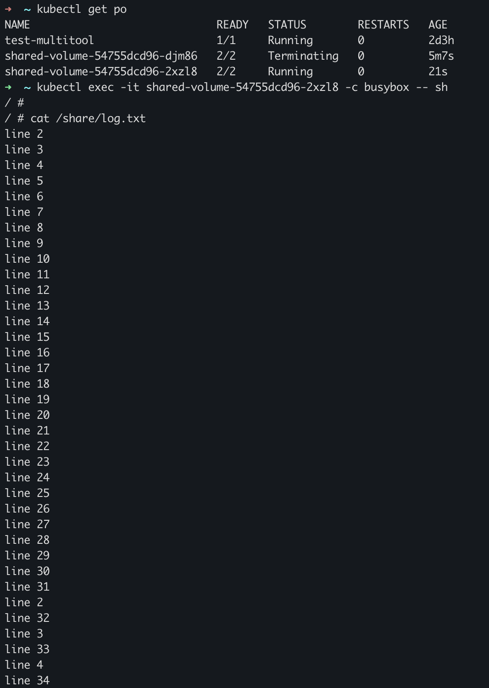
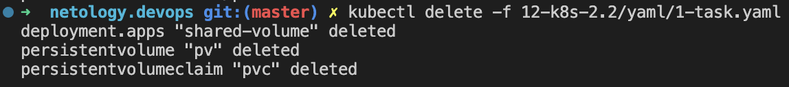
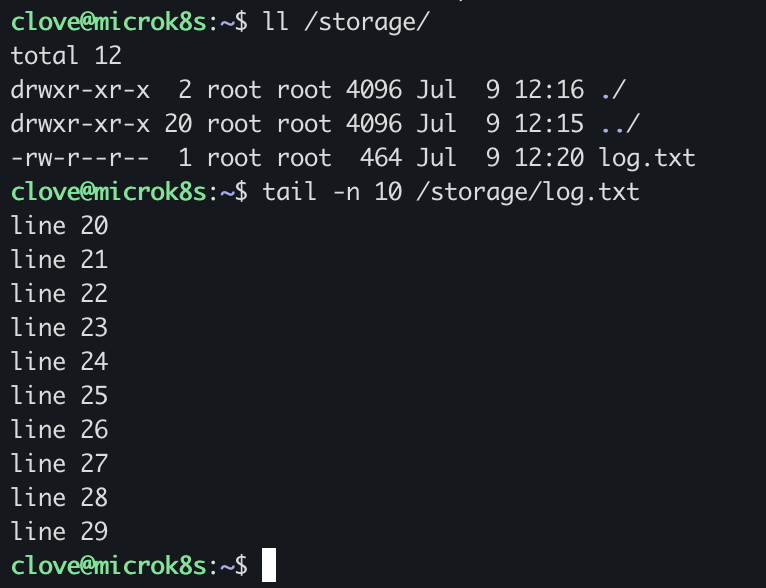
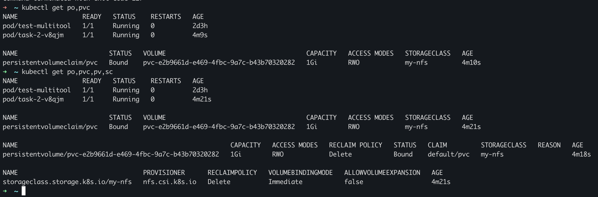
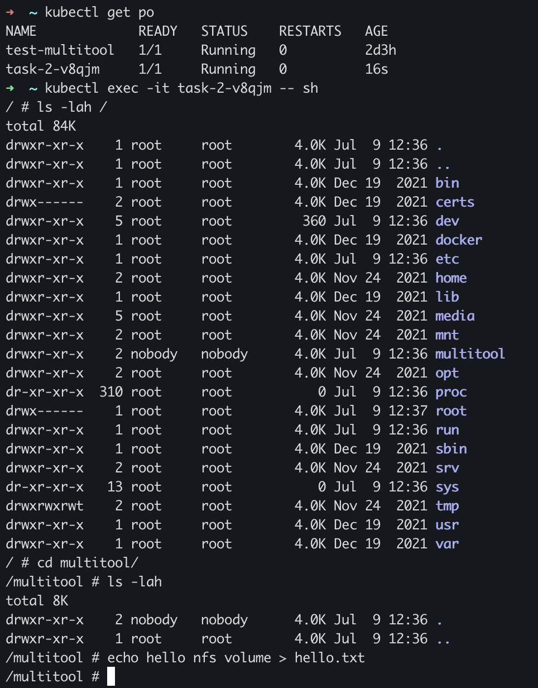
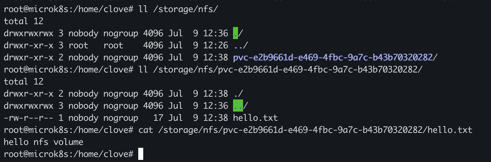

# Домашнее задание к занятию «Хранение в K8s. Часть 2»

### Цель задания

В тестовой среде Kubernetes нужно создать PV и продемострировать запись и хранение файлов.

------

### Чеклист готовности к домашнему заданию

1. Установленное K8s-решение (например, MicroK8S).
2. Установленный локальный kubectl.
3. Редактор YAML-файлов с подключенным GitHub-репозиторием.

------

### Дополнительные материалы для выполнения задания

1. [Инструкция по установке NFS в MicroK8S](https://microk8s.io/docs/nfs). 
2. [Описание Persistent Volumes](https://kubernetes.io/docs/concepts/storage/persistent-volumes/). 
3. [Описание динамического провижининга](https://kubernetes.io/docs/concepts/storage/dynamic-provisioning/). 
4. [Описание Multitool](https://github.com/wbitt/Network-MultiTool).

------

### Задание 1

**Что нужно сделать**

Создать Deployment приложения, использующего локальный PV, созданный вручную.

1. Создать Deployment приложения, состоящего из контейнеров busybox и multitool.
2. Создать PV и PVC для подключения папки на локальной ноде, которая будет использована в поде.
3. Продемонстрировать, что multitool может читать файл, в который busybox пишет каждые пять секунд в общей директории. 
4. Удалить Deployment и PVC. Продемонстрировать, что после этого произошло с PV. Пояснить, почему.
5. Продемонстрировать, что файл сохранился на локальном диске ноды. Удалить PV.  Продемонстрировать что произошло с файлом после удаления PV. Пояснить, почему.
5. Предоставить манифесты, а также скриншоты или вывод необходимых команд.

---

## Ответ:

[task 1 manifest](./yaml/1-task.yaml)

Проверяем что busybox пишет файл:


удаляем deploy:


Проверяем что файлы остались на диске после удаления:


Файл не удалился т.к Volume был размещен за пределами Pod-a, поэтому данные сохранились после удаления Deployment-a и Pod-a
Так же после удаления PV и PVC файл остался. И даже когда если указали RaclaimPolicy: Delete - файл остался, потому что Delete - это удаление ресурсов из внешних провайдеров (только в облачных Storage)

------

### Задание 2

**Что нужно сделать**

Создать Deployment приложения, которое может хранить файлы на NFS с динамическим созданием PV.

1. Включить и настроить NFS-сервер на MicroK8S.
2. Создать Deployment приложения состоящего из multitool, и подключить к нему PV, созданный автоматически на сервере NFS.
3. Продемонстрировать возможность чтения и записи файла изнутри пода. 
4. Предоставить манифесты, а также скриншоты или вывод необходимых команд.

---

## Ответ:

### Первым делом необходимо было подготовить сервер:

Установим nfs сервер:
```bash
apt install nfs-kernel-server
```
создадим каталог:
```bash
mkdir -p /storage/nfs
```
откроем доступ к ресурсу:
```bash
vim /etc/exports
    -> /storage/nfs *(rw,sync,no_subtree_check)
```
рестарт службы:
```bash
systemctl restart nfs-server
```

### Далее установить драйвера:

```bash
microk8s enable helm3

microk8s helm3 repo add csi-driver-nfs https://raw.githubusercontent.com/kubernetes-csi/csi-driver-nfs/master/charts

microk8s helm3 install csi-driver-nfs csi-driver-nfs/csi-driver-nfs \
    --namespace kube-system \
    --set kubeletDir=/var/snap/microk8s/common/var/lib/kubelet

microk8s kubectl wait pod --selector app.kubernetes.io/name=csi-driver-nfs --for condition=ready --namespace kube-system
```

смотрим результат установки:

```bash
kubectl get csidrivers
NAME             ATTACHREQUIRED   PODINFOONMOUNT   STORAGECAPACITY   TOKENREQUESTS   REQUIRESREPUBLISH   MODES        AGE
nfs.csi.k8s.io   false            false            false             <unset>         false               Persistent   45s
```

[task 2 manifest](./yaml/2-task.yaml)




