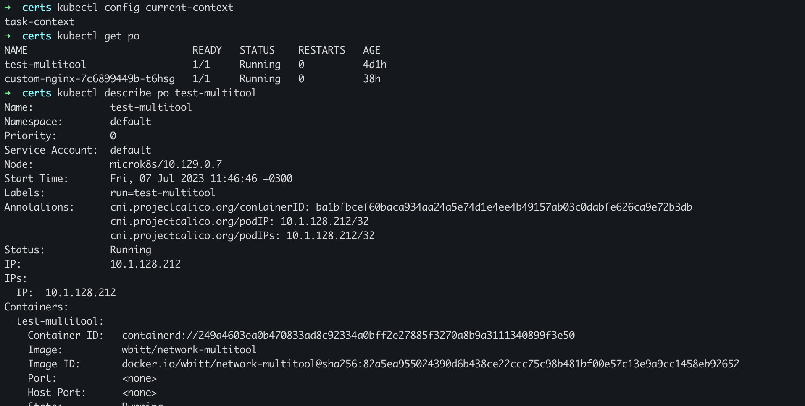

# Домашнее задание к занятию «Управление доступом»

### Цель задания

В тестовой среде Kubernetes нужно предоставить ограниченный доступ пользователю.

------

### Чеклист готовности к домашнему заданию

1. Установлено k8s-решение, например MicroK8S.
2. Установленный локальный kubectl.
3. Редактор YAML-файлов с подключённым github-репозиторием.

------

### Инструменты / дополнительные материалы, которые пригодятся для выполнения задания

1. [Описание](https://kubernetes.io/docs/reference/access-authn-authz/rbac/) RBAC.
2. [Пользователи и авторизация RBAC в Kubernetes](https://habr.com/ru/company/flant/blog/470503/).
3. [RBAC with Kubernetes in Minikube](https://medium.com/@HoussemDellai/rbac-with-kubernetes-in-minikube-4deed658ea7b).

------

### Задание 1. Создайте конфигурацию для подключения пользователя

1. Создайте и подпишите SSL-сертификат для подключения к кластеру.
2. Настройте конфигурационный файл kubectl для подключения.
3. Создайте роли и все необходимые настройки для пользователя.
4. Предусмотрите права пользователя. Пользователь может просматривать логи подов и их конфигурацию (`kubectl logs pod <pod_id>`, `kubectl describe pod <pod_id>`).
5. Предоставьте манифесты и скриншоты и/или вывод необходимых команд.

---

## Ответ:

Первым делом активируем rbac:
```bash
clove@microk8s:~$ microk8s enable rbac
Infer repository core for addon rbac
Enabling RBAC
Reconfiguring apiserver
Restarting apiserver
RBAC is enabled
```

Сгенерируем сертификаты:
```bash
root@microk8s:/home/clove/cert# openssl req -key task.key -new -out task.csr -subj "/CN=task/O=Netology/OU=k8stask"
root@microk8s:/home/clove/cert# openssl x509 -req -in task.csr -CA /var/snap/microk8s/5372/certs/ca.crt -CAkey /var/snap/microk8s/5372/certs/ca.key -CAcreateserial -out task.crt -days 7
Certificate request self-signature ok
subject=CN = task, O = Netology, OU = k8stask
root@microk8s:/home/clove/cert# microk8s config > /home/clove/cert/kubeconfig
```

Копируем конфиг и сертификаты к себе и настраиваем:
```bash
export KUBECONFIG=$PWD/kubeconfig

kubectl config set-credentials task --client-certificate=task.crt --client-key=task.key
User "task" set.

kubectl config set-context task-context --cluster=microk8s-cluster --user=task
Context "task-context" created.

kubectl config view
apiVersion: v1
clusters:
- cluster:
    certificate-authority-data: DATA+OMITTED
    server: https://84.201.166.238:16443
  name: microk8s-cluster
contexts:
- context:
    cluster: microk8s-cluster
    user: task
  name: task-context
current-context: task-context
kind: Config
preferences: {}
users:
- name: task
  user:
    client-certificate: task.crt
    client-key: task.key

kubectl config use-context task-context
Switched to context "task-context".

kubectl config current-context
task-context
```

Так как по умолчанию запрещено все, получаем результат:
```bash
kubectl get po
Error from server (Forbidden): pods is forbidden: User "task" cannot list resource "pods" in API group "" in the namespace "default"
```

Применяем [**манифест с ролью для пользователя task**](./yaml/1-task.yaml)
```bash
kubectl apply -f 12-k8s-2.4/yaml/1-task.yaml
role.rbac.authorization.k8s.io/pod-reader created
rolebinding.rbac.authorization.k8s.io/read-pods created
```

Проверяем результат:

