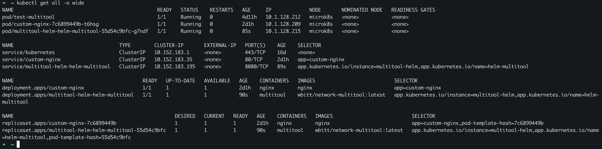
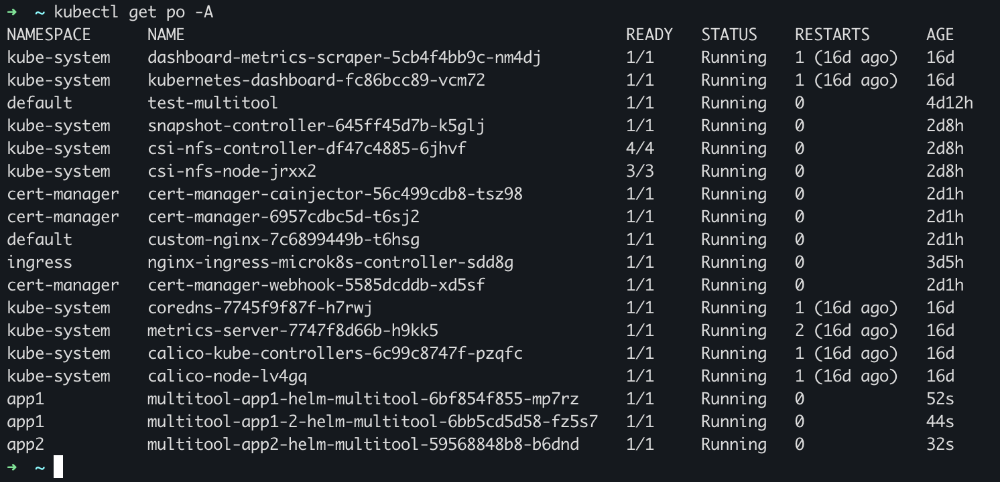

# Домашнее задание к занятию «Helm»

### Цель задания

В тестовой среде Kubernetes необходимо установить и обновить приложения с помощью Helm.

------

### Чеклист готовности к домашнему заданию

1. Установленное k8s-решение, например, MicroK8S.
2. Установленный локальный kubectl.
3. Установленный локальный Helm.
4. Редактор YAML-файлов с подключенным репозиторием GitHub.

------

### Инструменты и дополнительные материалы, которые пригодятся для выполнения задания

1. [Инструкция](https://helm.sh/docs/intro/install/) по установке Helm. [Helm completion](https://helm.sh/docs/helm/helm_completion/).

------

### Задание 1. Подготовить Helm-чарт для приложения

1. Необходимо упаковать приложение в чарт для деплоя в разные окружения. 
2. Каждый компонент приложения деплоится отдельным deployment’ом или statefulset’ом.
3. В переменных чарта измените образ приложения для изменения версии.

---

## Ответ:

Создаем шаблон:
```bash
➜  helm git:(master) ✗ helm create multitool
Creating multitool
```

Вносим изменения:<br>
[chart.yaml](./helm/multitool/Chart.yaml)<br>
[values.yaml](./helm/multitool/values.yaml)<br>
[deployment.yaml](./helm/multitool/templates/deployment.yaml)<br>

Проверяем код:
```bash
helm git:(master) ✗ helm lint multitool
==> Linting multitool
[INFO] Chart.yaml: icon is recommended

1 chart(s) linted, 0 chart(s) failed
```

Деплоим
```bash
➜  helm git:(master) ✗ helm install multitool-helm multitool 
NAME: multitool-helm
LAST DEPLOYED: Tue Jul 11 23:19:03 2023
NAMESPACE: default
STATUS: deployed
REVISION: 1
NOTES:
Deploy successful
```

Пробуем проднять версию, отредактировав [Chart.yaml](./helm/multitool/Chart.yaml)
```bash
➜  helm git:(master) ✗ helm upgrade multitool-helm multitool
Release "multitool-helm" has been upgraded. Happy Helming!
NAME: multitool-helm
LAST DEPLOYED: Tue Jul 11 23:21:21 2023
NAMESPACE: default
STATUS: deployed
REVISION: 2
NOTES:
Deploy successful
```



Удаляем деплой:
```bash
➜  helm git:(master) ✗ helm uninstall multitool-helm multitool
release "multitool-helm" uninstalled
```

------
### Задание 2. Запустить две версии в разных неймспейсах

1. Подготовив чарт, необходимо его проверить. Запуститe несколько копий приложения.
2. Одну версию в namespace=app1, вторую версию в том же неймспейсе, третью версию в namespace=app2.
3. Продемонстрируйте результат.

---

## Ответ:

Запустим деплой в разных namespace:
```bash
helm git:(master) ✗ helm install --create-namespace -n app1 multitool-app1 multitool
NAME: multitool-app1
LAST DEPLOYED: Tue Jul 11 23:51:42 2023
NAMESPACE: app1
STATUS: deployed
REVISION: 1
NOTES:
Deploy successful
➜  helm git:(master) ✗ helm install --create-namespace -n app1 multitool-app1-2 multitool
NAME: multitool-app1-2
LAST DEPLOYED: Tue Jul 11 23:51:50 2023
NAMESPACE: app1
STATUS: deployed
REVISION: 1
NOTES:
Deploy successful
➜  helm git:(master) ✗ helm install --create-namespace -n app2 multitool-app2 multitool
NAME: multitool-app2
LAST DEPLOYED: Tue Jul 11 23:52:01 2023
NAMESPACE: app2
STATUS: deployed
REVISION: 1
NOTES:
Deploy successful
```

