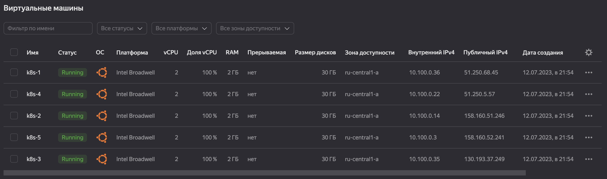
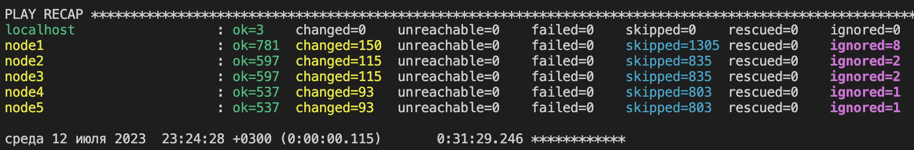
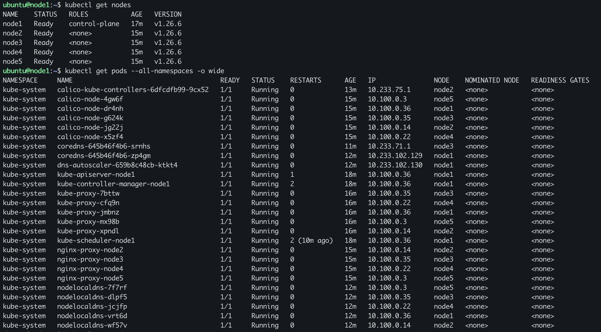

# Домашнее задание к занятию «Установка Kubernetes»

### Цель задания

Установить кластер K8s.

### Чеклист готовности к домашнему заданию

1. Развёрнутые ВМ с ОС Ubuntu 20.04-lts.


### Инструменты и дополнительные материалы, которые пригодятся для выполнения задания

1. [Инструкция по установке kubeadm](https://kubernetes.io/docs/setup/production-environment/tools/kubeadm/create-cluster-kubeadm/).
2. [Документация kubespray](https://kubespray.io/).

-----

### Задание 1. Установить кластер k8s с 1 master node

1. Подготовка работы кластера из 5 нод: 1 мастер и 4 рабочие ноды.
2. В качестве CRI — containerd.
3. Запуск etcd производить на мастере.
4. Способ установки выбрать самостоятельно.

## Дополнительные задания (со звёздочкой)

**Настоятельно рекомендуем выполнять все задания под звёздочкой.** Их выполнение поможет глубже разобраться в материале.   
Задания под звёздочкой необязательные к выполнению и не повлияют на получение зачёта по этому домашнему заданию. 

------
### Задание 2*. Установить HA кластер

1. Установить кластер в режиме HA.
2. Использовать нечётное количество Master-node.
3. Для cluster ip использовать keepalived или другой способ.

---

## Ответ:

В яндексе развернул VM с помощью terraform:

[конфигурация terraform](./deploy/terraform/)



С помощью kuberspray развернул кластер:

```bash
git clone https://github.com/kubernetes-sigs/kubespray

sudo pip3 install -r requirements.txt

ansible-playbook -i inventory/mycluster/inventory.ini cluster.yml -b -v
```



Сформируем kubeconfig:
```bash
ubuntu@node1:~$ mkdir -p .kube
ubuntu@node1:~$ sudo cp /etc/kubernetes/admin.conf .kube/config
ubuntu@node1:~$ sudo chown $(id -u):$(id -g) .kube/config
```

Результат:


