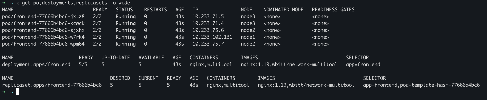
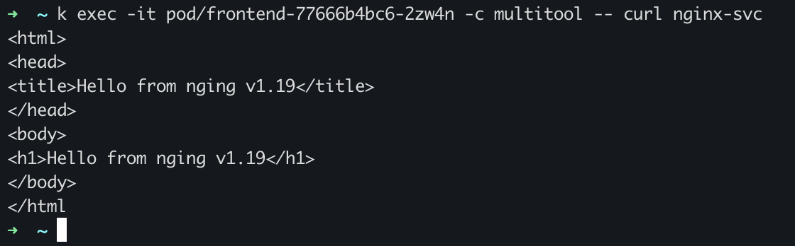
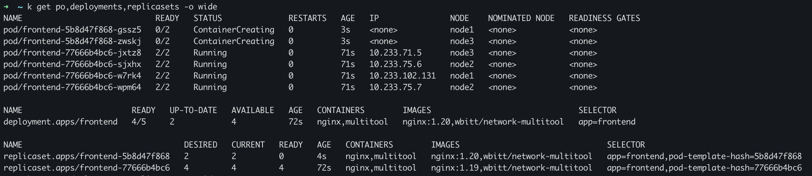
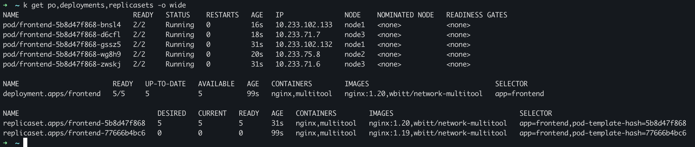
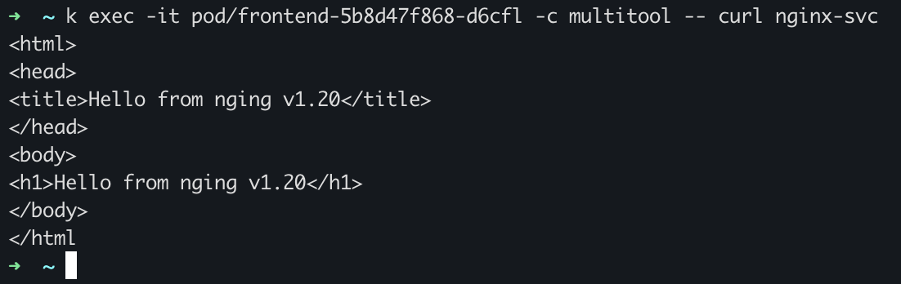
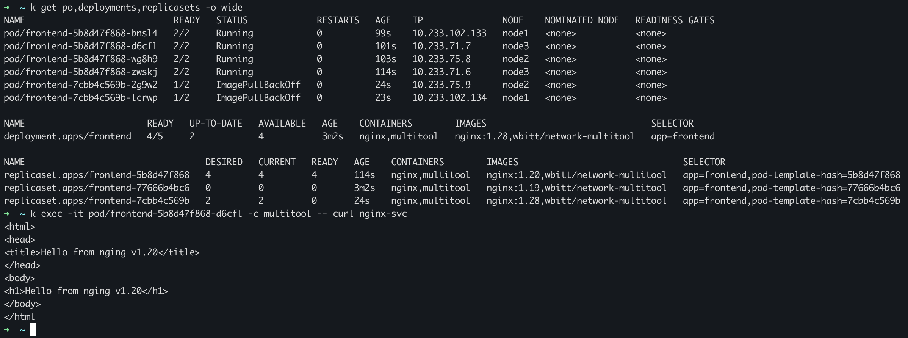
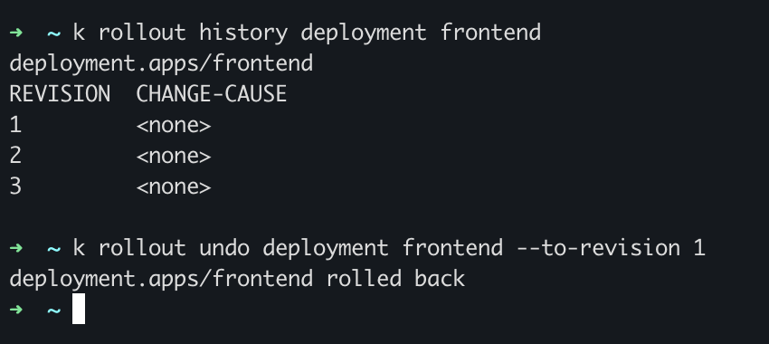
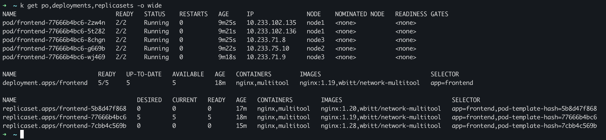
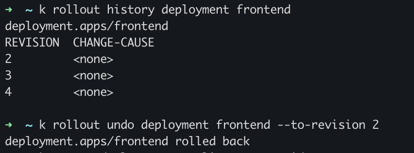
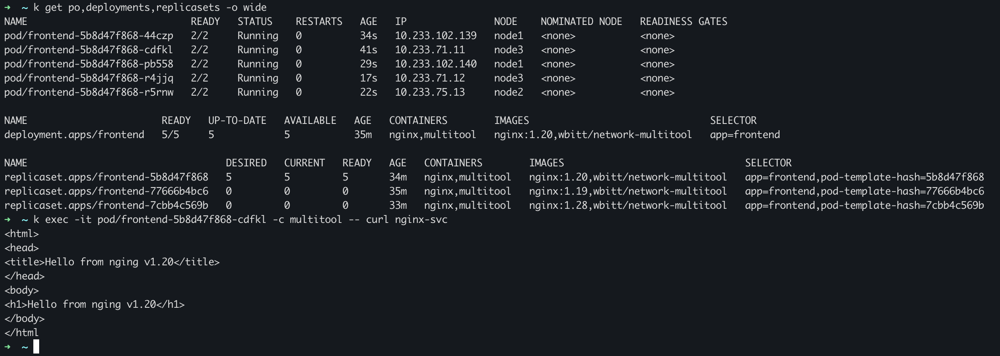

# Домашнее задание к занятию «Обновление приложений»

### Цель задания

Выбрать и настроить стратегию обновления приложения.

### Чеклист готовности к домашнему заданию

1. Кластер K8s.

### Инструменты и дополнительные материалы, которые пригодятся для выполнения задания

1. [Документация Updating a Deployment](https://kubernetes.io/docs/concepts/workloads/controllers/deployment/#updating-a-deployment).
2. [Статья про стратегии обновлений](https://habr.com/ru/companies/flant/articles/471620/).

-----

### Задание 1. Выбрать стратегию обновления приложения и описать ваш выбор

1. Имеется приложение, состоящее из нескольких реплик, которое требуется обновить.
2. Ресурсы, выделенные для приложения, ограничены, и нет возможности их увеличить.
3. Запас по ресурсам в менее загруженный момент времени составляет 20%.
4. Обновление мажорное, новые версии приложения не умеют работать со старыми.
5. Вам нужно объяснить свой выбор стратегии обновления приложения.

---

## Ответ:

Самое главное ограничение - запас ресурсов 20% и предыдущие версии не совместимы с новыми. \
Поэтому метод Blue/Green не подходит. \
Rolling update тоже, т.к отсутствует совместимость версий приложения. \
Канареечный метод не подходит так же, как и А/В тестирование, из-за требования большого количества ресурсов. \
Остается только метод обновления Recreate, т.к. на уже выделенных ресурсах он сначала удалит старую версию приложения, затем развернет новую версию.

### Задание 2. Обновить приложение

1. Создать deployment приложения с контейнерами nginx и multitool. Версию nginx взять 1.19. Количество реплик — 5.
2. Обновить версию nginx в приложении до версии 1.20, сократив время обновления до минимума. Приложение должно быть доступно.
3. Попытаться обновить nginx до версии 1.28, приложение должно оставаться доступным.
4. Откатиться после неудачного обновления.

---

## Ответ:

Использовалось 3 манифеста: \
[1.19](./deploy/1-nginx_1.19.yaml) \
[1.20](./deploy/1-nginx_1.20.yaml) \
[1.28](./deploy/1-nginx_1.28.yaml)

Применяем деплоймент к версии [1.19](./deploy/1-nginx_1.19.yaml):

Запрос к сервису:

Обновляем версию до [1.20](./deploy/1-nginx_1.20.yaml) \
Обновление происходит постепенно, приложение при этом остается доступно:

Обновление прошло успешно:

Проверям доступность:

Обновляем версию до неудачной [1.28](./deploy/1-nginx_1.28.yaml) \
Как видим обновление происходит так же постепенно, но новая версия не может запуститься и обновление останавливается, при этом приложение с прошлой версией все еще работает:

Делаем rollout к перой версии:

Возврат к первоначальной версии успешно прошел:

В дополнение ради интереса можно вернуться к версии 1.20(видим что первая версия деплоймента переместилась на 4 позицию):

