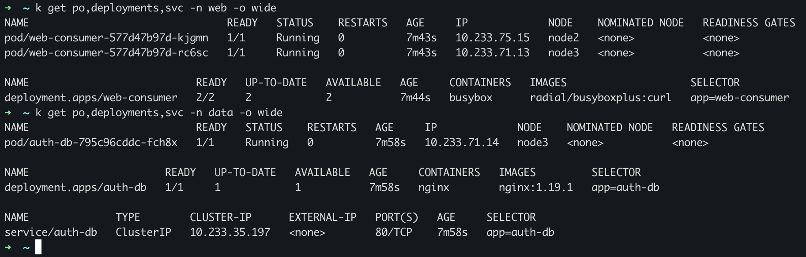
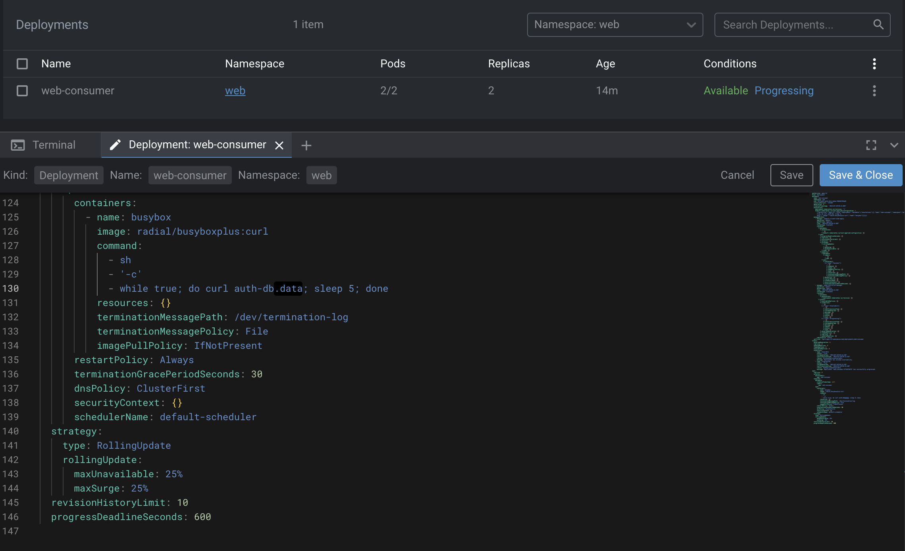
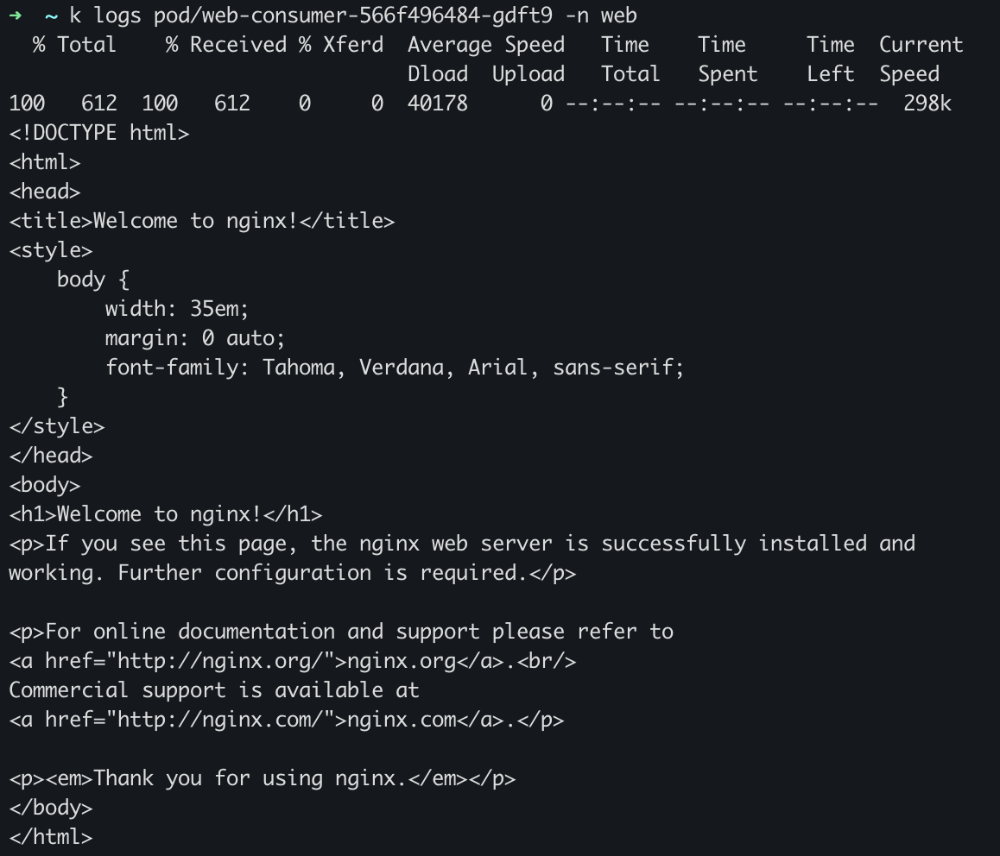

# Домашнее задание к занятию Troubleshooting

### Цель задания

Устранить неисправности при деплое приложения.

### Чеклист готовности к домашнему заданию

1. Кластер K8s.

### Задание. При деплое приложение web-consumer не может подключиться к auth-db. Необходимо это исправить

1. Установить приложение по команде:
```shell
kubectl apply -f https://raw.githubusercontent.com/netology-code/kuber-homeworks/main/3.5/files/task.yaml
```
2. Выявить проблему и описать.
3. Исправить проблему, описать, что сделано.
4. Продемонстрировать, что проблема решена.

---

## Ответ:

Пробуем применить:
```shell
➜  deploy git:(master) ✗ kubectl apply -f https://raw.githubusercontent.com/netology-code/kuber-homeworks/main/3.5/files/task.yaml
Error from server (NotFound): error when creating "https://raw.githubusercontent.com/netology-code/kuber-homeworks/main/3.5/files/task.yaml": namespaces "web" not found
Error from server (NotFound): error when creating "https://raw.githubusercontent.com/netology-code/kuber-homeworks/main/3.5/files/task.yaml": namespaces "data" not found
Error from server (NotFound): error when creating "https://raw.githubusercontent.com/netology-code/kuber-homeworks/main/3.5/files/task.yaml": namespaces "data" not found
```

Создаем необходимые namespace:
```bash
➜  deploy git:(master) ✗ k create ns web
namespace/web created
➜  deploy git:(master) ✗ k create ns data
namespace/data created
```

Пробуем еще раз:
```bash
➜  deploy git:(master) ✗ kubectl apply -f https://raw.githubusercontent.com/netology-code/kuber-homeworks/main/3.5/files/task.yaml
deployment.apps/web-consumer created
deployment.apps/auth-db created
service/auth-db created
```



Видим что на первый взгляд контейнеры поднялись, смотрим логи:
```bash
➜  ~ k logs pod/auth-db-795c96cddc-fch8x -n data
/docker-entrypoint.sh: /docker-entrypoint.d/ is not empty, will attempt to perform configuration
/docker-entrypoint.sh: Looking for shell scripts in /docker-entrypoint.d/
/docker-entrypoint.sh: Launching /docker-entrypoint.d/10-listen-on-ipv6-by-default.sh
10-listen-on-ipv6-by-default.sh: Getting the checksum of /etc/nginx/conf.d/default.conf
10-listen-on-ipv6-by-default.sh: Enabled listen on IPv6 in /etc/nginx/conf.d/default.conf
/docker-entrypoint.sh: Launching /docker-entrypoint.d/20-envsubst-on-templates.sh
/docker-entrypoint.sh: Configuration complete; ready for start up

➜  ~ k logs pod/web-consumer-577d47b97d-kjgmn -n web
curl: (6) Couldn't resolve host 'auth-db'
curl: (6) Couldn't resolve host 'auth-db'
curl: (6) Couldn't resolve host 'auth-db'
curl: (6) Couldn't resolve host 'auth-db'
curl: (6) Couldn't resolve host 'auth-db'
```

Видим что контейнер web, не может достучатся до базы, потому что поды находятся в разных namespace, отредактируем deployment и допишем адрес auth-db.data:



Видим что теперь запрос до БД успешно доходит:

